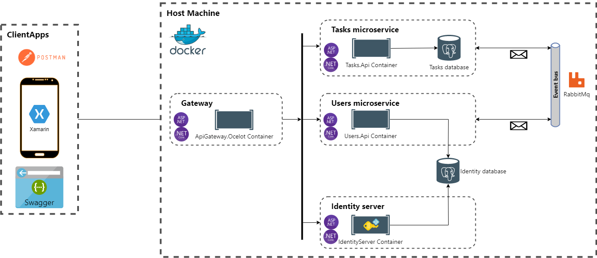

# Work planner Backend Web API

Backend part for my project "Work planner"

See also [frontend part](https://github.com/Inozpavel/WorkPlanner.Android)

The main idea of the project is a work execution planner. Users can create rooms and tasks within them. They can then
invite other users to join their rooms or join existing room then issue tasks and view their statuses.

The security system is made using identity server 4. There are registration, authorization systems. After registration,
the user will be sent an email for confirmation. Users have roles inside the rooms.

It is microservice architecture project. All access to microservices is implemented through the api gateway. Also, each
microservice is located in a docker container.

| Status | Master | Develop |
| ------ | ------ | ------- |
|  Build | [](https://github.com/Inozpavel/WorkPlanner.WebApi/actions/workflows/dotnet.yml) | [](https://github.com/Inozpavel/WorkPlanner.WebApi/actions/workflows/dotnet.yml) |

## Prerequisites for launching

[Docker Desktop](https://www.docker.com/products/docker-desktop)

## Run system locally using Docker images

To run project open console in folder with [docker-compose.yml](docker-compose.yml?raw=true) file and run this commands

1. Pull services images from Docker Hub

```cmd
docker-compose pull
```

2. Run services

```cmd
docker-compose up -d
```

After starting API will be available on [localhost:4000](http://localhost:4000)

Documentation will be available on [localhost:4000/swagger](http://localhost:4000/swagger)

## Project Information

### Project technologies stack

Main framework

- [ASP.Net Core](https://dotnet.microsoft.com/apps/aspnet)

Database

- [PostgreSQL](https://www.postgresql.org/)

Security

- [Identity Server 4](https://identityserver4.readthedocs.io/en/latest/)

ORM

- [Entity Framework Core for PostgreSQL](https://www.nuget.org/packages?q=postgre)

API Gateway

- [Ocelot](https://github.com/ThreeMammals/Ocelot)

Message broker

- [RabbitMQ (MassTransit)](https://masstransit-project.com/usage/transports/rabbitmq.html)

Documentation

- [Swagger](https://swagger.io/)

Packages

- [AutoMapper](https://github.com/AutoMapper/AutoMapper)
- [AspNetCore.Identity](https://www.nuget.org/packages/Microsoft.AspNetCore.Identity.EntityFrameworkCore/)

## Project Architecture



Patterns

- UnitOfWork
- Repository
- Microservices architecture